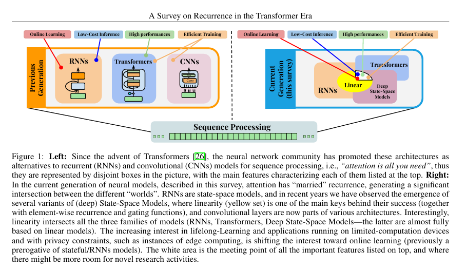

# Long Context 101
**Tags:** Curated Knowledge, Memory

## Abstract
Here, I'm consolidating what I understand about methods current LLM uses to handle long context so far (limited to my knowledge not source of truth, there can be mistakes in my understanding)

## Overview
Most popular LLMs today (GPT, Claude, Gemini, Llama, etc.) use the Transformer architecture, which relies on **self-attention** to process input tokens. Self-attention computes token-to-token interactions, so naïve dense attention scales quadratically with sequence length, making very long contexts expensive in compute and memory. 

From my experience with LLM, I believe we can separate “long context” into three perspectives:
- **Compute/memory capacity**: how many tokens the model can afford to process
- **Efficiency**: how well the model can actually find and use the right information inside that many tokens.

Self-attention in Transformer is insanely expensive. It is defined as $Attention(Q, K, V) = softmax(\frac{QK^T}{\sqrt{d}})V$, requires computing a pairwise similarity matrix between all tokens in the sequence. For a sequence of length $L$, this incurs a computational cost of $O(L^2)$ during the prefill phase and necessitates a Key-Value (KV) cache that grows linearly $O(L)$ in memory during decoding

While hardware improvements (HBM capacity, FlashAttention) have pushed the physical limit of $L$ to the millions, there is Context Rot. Empirical observation suggests that even when a model can technically ingest a million tokens, its ability to retrieve specific information ("Needle-in-a-Haystack") and reason over it degrades as the "Haystack" grows. The signal-to-noise ratio in the attention mechanism deteriorates, a steep degradation in quality for frontier models like GPT-5 as context extends. 

Some useful sources relating to degradation over long context:
- [Lost in the Middle: How Language Models Use Long Contexts](https://arxiv.org/pdf/2307.03172)
- [NOLIMA: Long-Context Evaluation Beyond Literal Matching](https://arxiv.org/pdf/2502.05167)

---

## Architectural Approaches

### State Space Models (SSMs)

There already a really good survey paper on this topic in mid 2025. What I discuss in the following section is just my understanding of the topic. For reliable truth, please refer to the [survey paper](https://arxiv.org/html/2406.09062v2#bib.bib42)

State Space is a foundation concept in control theory formalized by [R.E. Kalman (1960)](https://www.cs.cmu.edu/~motionplanning/papers/sbp_papers/k/Kalman1960.pdf) Introduces the equation ($h' = Ah + Bx$). Kalman was using these equations to estimate the state of a dynamic system (like a rocket or an engine) over time from noisy data. Later, this concept was extended to deep learning.

Transformer architecture, introduced in 2017, established itself as the dominant framework due to its core mechanism: self-attention. Mathematically, self-attention computes a weighted sum of values based on the similarity between a query and all keys in the sequence. For a sequence of length $L$, this operation necessitates the construction of an attention matrix of size $L \times L$. Consequently, the time complexity and memory complexity of the self-attention mechanism scale quadratically, or $O(L^2)$. While this allows for dense, global information routing where every token can directly influence every other token, the quadratic cost becomes a prohibitive bottleneck as $L$ increases. For ultra-long sequences—such as entire genomes, high-resolution audio waveforms, or context windows exceeding 100,000 tokens—the Transformer becomes computationally intractable without significant approximation

Before Transformers, RNN is one of the popular choice. It operate on a Markovian principle. They process sequences sequentially, maintaining a hidden state $h_t$ that functions as a compressed summary of the history up to time $t$. The update rule $h_t = f(h_{t-1}, x_t)$ implies that inference requires only $O(1)$ time per step (constant time) and $O(1)$ memory (constant memory), regardless of the sequence length history. This linear scaling $O(L)$ for the entire sequence makes RNNs theoretically ideal for infinite contexts. However, standard RNNs suffer from two critical flaws. First, they are inherently sequential during training; the state $h_t$ cannot be computed until $h_{t-1}$ is known, preventing parallelization across the time dimension on modern hardware accelerators like GPUs and TPUs. Second, they struggle with the "vanishing gradient" problem, where information from early time steps decays exponentially, making it difficult to capture long-range dependencies

Transformers trade higher compute/memory for global, parallel information routing

Structured State Space Models (SSMs) have emerged to try solving this tradeoff (not fully as there are lots of issues pointed out in the Mamba-2 paper leading to their approach hybrid with Transformers self attention).

#### Math foundation
##### 1. Continuous Time Linear Dynamic
An SSM maps a 1-dimensional continuous input signal $x(t) \in \mathbb{R}$ to a 1-dimensional output signal $y(t) \in \mathbb{R}$ via an $N$-dimensional latent state $h(t) \in \mathbb{R}^N$. The evolution of this system is governed by a first-order Ordinary Differential Equation (ODE):
$$
h'(t) = \mathbf{A}h(t) + \mathbf{B}x(t)
$$
$$
y(t) = \mathbf{C}h(t) + \mathbf{D}x(t)
$$
Here, the matrices defining the system are:
- $\mathbf{A} \in \mathbb{R}^{N \times N}$ (State Transition Matrix): This matrix dictates the dynamics of the latent state. It determines how the previous state influences the rate of change of the current state. The eigenvalues of $\mathbf{A}$ determine the stability of the system; for long-term memory, we typically require the real part of these eigenvalues to be negative to prevent the state from exploding.
- $\mathbf{B} \in \mathbb{R}^{N \times 1}$ (Input Matrix): This vector projects the scalar input $x(t)$ into the $N$-dimensional state space. It controls how the input modifies the state evolution.
- $\mathbf{C} \in \mathbb{R}^{1 \times N}$ (Output Matrix): This vector projects the high-dimensional state $h(t)$ back down to the scalar output $y(t)$. It can be interpreted as a "readout" vector that scans the state to produce the result.
- $\mathbf{D} \in \mathbb{R}^{1 \times 1}$ (Feedthrough Matrix): This scalar represents a direct skip connection from the input to the output, bypassing the state entirely. In many deep learning implementations, this is equivalent to a residual connection and is often computed separately.

In the context of deep neural networks, this SISO (Single-Input Single-Output) system is applied independently to each feature dimension (or channel) of the input embedding. If the input embedding has dimension $H$, the model learns $H$ independent sets of matrices $\mathbf{A}, \mathbf{B}, \mathbf{C}$.

##### 2. Discretization
Neural networks operate on discrete data sequences (tokenized text, sampled audio), not continuous signals. Therefore, the continuous ODE must be transformed into a discrete recurrence relation. This process is known as discretization.Discretization introduces a strictly positive parameter $\Delta$ (Delta), representing the step size or sampling interval. The goal is to transform the continuous parameters $(\mathbf{A}, \mathbf{B})$ into discrete parameters $(\overline{\mathbf{A}}, \overline{\mathbf{B}})$ such that the discrete sequence $h_k$ approximates the continuous state $h(k\Delta)$.Two primary methods are utilized in the SSM literature: the Zero-Order Hold (ZOH) and the Bilinear Transform.

**Zero-Order Hold (ZOH)**
ZOH method makes a functional assumption that the continuous input signal $x(t)$ is constant (held) during the sampling interval $$. Under this assumption, the differential equation can be solved analytically. The resulting discrete recurrence is
$$
h_k = \overline{\mathbf{A}} h_{k-1} + \overline{\mathbf{B}} x_k
$$
$$
y_k = \mathbf{C} h_k
$$
The discrete matrices are derived as follows:
$$
\overline{\mathbf{A}} = \exp(\Delta \mathbf{A})
$$
$$
\overline{\mathbf{B}} = (\Delta \mathbf{A})^{-1} (\exp(\Delta \mathbf{A}) - \mathbf{I}) \cdot \Delta \mathbf{B}
$$

Here, $\exp(\cdot)$ denotes the matrix exponential, not element-wise exponentiation. The ZOH method is favored in recent architectures like Mamba because it aligns with the intuition of discrete inputs (tokens) holding their value until the next token arrives.

**Bilinear Transform**

Bilinear Transform (also known as Tustin's method) approximates the integration using the trapezoidal rule. It transforms the continuous system into a discrete system by mapping the s-plane (Laplace domain) to the z-plane. The formulas are :
$$
\overline{\mathbf{A}} = (\mathbf{I} - \Delta/2 \cdot \mathbf{A})^{-1} (\mathbf{I} + \Delta/2 \cdot \mathbf{A})
$$
$$
\overline{\mathbf{B}} = (\mathbf{I} - \Delta/2 \cdot \mathbf{A})^{-1} \Delta \mathbf{B}
$$
The Bilinear transform is particularly useful because it preserves the stability of the system. If the continuous matrix $\mathbf{A}$ is stable (eigenvalues in the left half-plane), the discrete matrix $\overline{\mathbf{A}}$ is guaranteed to be stable (eigenvalues inside the unit circle). This method was heavily utilized in the original S4 model.

##### Dual Views: Recurrence and Convolution

A defining characteristic of Linear Time-Invariant (LTI) SSMs is that they can be computed in two mathematically equivalent ways, providing flexibility for different stages of the machine learning pipeline.

**Recurrence**
$$
h_t = \overline{\mathbf{A}} h_{t-1} + \overline{\mathbf{B}} x_t
$$
$$
y_t = \mathbf{C} h_t
$$
This form is identical to a standard Recurrent Neural Network. The state $h_t$ depends only on the previous state $h_{t-1}$ and the current input. This allows for autoregressive generation where tokens are produced one by one. The computational complexity is $O(1)$ per time step (constant time), and the memory requirement is $O(N)$ (constant memory to store the state), regardless of the sequence length. This contrasts sharply with Transformers, which must re-scan the entire history (KV cache) for each new token.

**Convolution**

Because the system is linear and time-invariant (the matrices $\overline{\mathbf{A}}, \overline{\mathbf{B}}$ do not change with time $t$), the relationship between the input sequence $x$ and output sequence $y$ can be expressed as a convolution.

If we unroll the recurrence: 
$$h_0 = \overline{\mathbf{B}}x_0$$
$$h_1 = \overline{\mathbf{A}}\overline{\mathbf{B}}x_0 + \overline{\mathbf{B}}x_1$$
$$h_2 = \overline{\mathbf{A}}^2\overline{\mathbf{B}}x_0 + \overline{\mathbf{A}}\overline{\mathbf{B}}x_1 + \overline{\mathbf{B}}x_2$$
$$...$$
$$y_k = \mathbf{C}h_k = \sum_{j=0}^{k} (\mathbf{C}\overline{\mathbf{A}}^{k-j}\overline{\mathbf{B}}) x_j$$

This summation is a discrete convolution $y = x * \overline{\mathbf{K}}$, where $\overline{\mathbf{K}}$ is the SSM Convolution Kernel:
$$
\overline{\mathbf{K}} = (\mathbf{C}\overline{\mathbf{B}}, \mathbf{C}\overline{\mathbf{A}}\overline{\mathbf{B}}, \mathbf{C}\overline{\mathbf{A}}^2\overline{\mathbf{B}}, \dots, \mathbf{C}\overline{\mathbf{A}}^{L-1}\overline{\mathbf{B}})
$$
The Convolution Theorem states that convolution in the time domain is equivalent to multiplication in the frequency domain. Therefore, the entire output sequence can be computed simultaneously by:

- Computing the Fast Fourier Transform (FFT) of the input $x$ and the kernel $\overline{\mathbf{K}}$
- Multiplying them element-wise
- Computing the Inverse FFT (iFFT)

This reduces the training complexity from $O(L)$ (sequential) to $O(L \log L)$ and allows full parallelization on GPUs.

#### S4: Structured State Space Sequence Model

The theoretical framework of SSMs existed long before their application in deep learning. However, naive implementations faced a critical hurdle: the memory horizon. Standard random initializations of the state matrix $\mathbf{A}$ fail to retain information over long sequences due to exponential decay. [Structured State Space (S4) model](https://arxiv.org/pdf/2111.00396), solved this by imposing a specific mathematical structure on $\mathbf{A}$.

**HiPPO Initialization**

To capture long-range dependencies—sometimes spanning thousands of time steps—S4 employs the HiPPO (History Preservation by Polynomial) theory. The intuition is to define the state $h(t)$ as the coefficients of the optimal polynomial approximation of the entire input history $x(t)$ up to the current time.

Mathematically, HiPPO derives a specific matrix $\mathbf{A}$ that minimizes the approximation error with respect to a measure (e.g., Legendre polynomials). The resulting HiPPO Matrix (for the Legendre measure) is:

$$
\mathbf{A}_{nk} = - \begin{cases} 
(2n+1)^{1/2}(2k+1)^{1/2} & \text{if } n > k \\
n+1 & \text{if } n = k \\
0 & \text{if } n < k
\end{cases}
$$

This matrix allows the state to mathematically compress the history of the input. However, this specific matrix is non-normal (it does not commute with its conjugate transpose), which makes it computationally expensive to exponentiate for the discretization step needed for the recurrence. 

**NPLR Parametrization**

Calculating the discrete matrix $\overline{\mathbf{A}}$ via the bilinear transform requires computing the matrix inverse $(\mathbf{I} - \Delta/2 \cdot \mathbf{A})^{-1}$. For a general $N \times N$ matrix, inversion is an $O(N^3)$ operation, which is too slow to perform repeatedly during training.

S4 bypasses this by decomposing the HiPPO matrix into a Normal Plus Low-Rank (NPLR) structure:

$$\mathbf{A} = \mathbf{V} \mathbf{\Lambda} \mathbf{V}^* - \mathbf{P} \mathbf{Q}^*$$

Where:
- $\mathbf{V} \mathbf{\Lambda} \mathbf{V}^*$ is a normal matrix (diagonalizable by a unitary matrix)
- $\mathbf{P} \mathbf{Q}^*$ is a low-rank correction (rank 1 or 2)

This decomposition allows the use of the Woodbury Matrix Identity, a linear algebra theorem that expresses the inverse of a rank-$k$ correction of a matrix in terms of the inverse of the original matrix. Since inverting the diagonal component is trivial ($O(N)$), the NPLR structure reduces the complexity of generating the convolution kernel to $O(L + N)$, making the model efficient enough for deep learning scales.

#### S5: Simplified Structured State Space

While S4 was a breakthrough, its implementation was mathematically intricate and difficult to implement efficiently without custom CUDA kernels. [S5 model](https://arxiv.org/pdf/2305.08290) proposed a radical simplification to improve usability and efficiency
