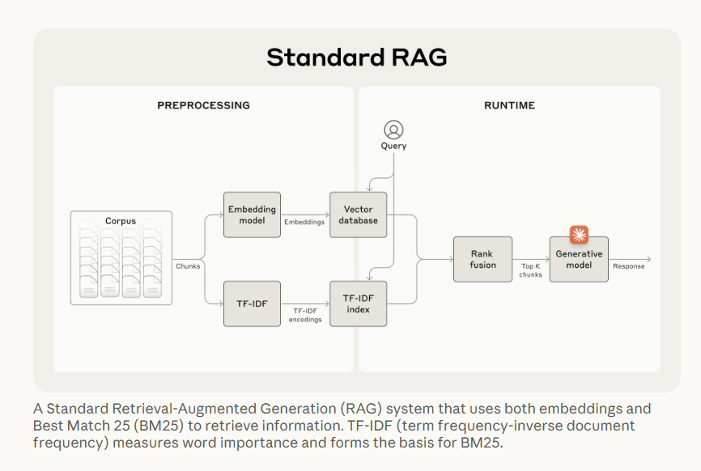
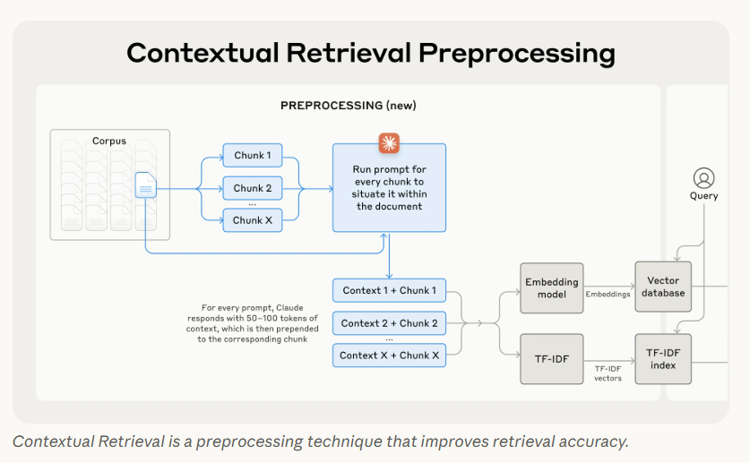
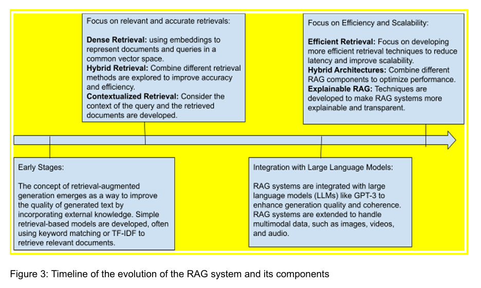
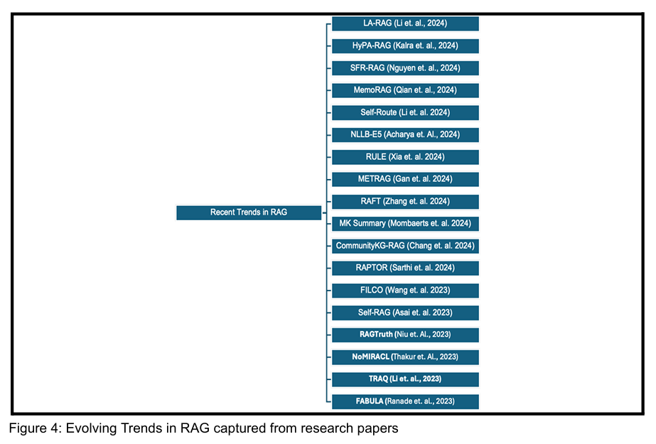
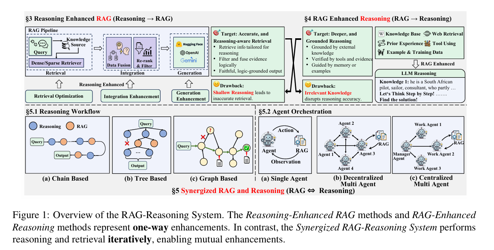
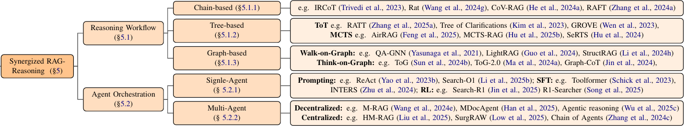

# RAG 101
**Tags:** Curated Knowledge, RAG, Memory, Retriever, Reasoning

## Abstract
Here, I'm consolidating what I understand about RAG so far (there can be mistakes in my understanding)

## Overview
> **RAG = Retriever + Generator**

Before LLM generates an answer, it first retrieves relevant information (documents, facts, etc.) from some knowledge source, and then generates a response using both the user query and the retrieved content as context. In other words, RAG “augments” the model’s prompt with outside knowledge so that the model isn’t limited to only what’s in its frozen training data. The external knowledge can be anything: a database of company documents, an index of Wikipedia, or live data from the web. Crucially, RAG can incorporate new and domain-specific information without retraining LLM. It has quickly become a go-to method for building AI applications that require up-to-date, accurate, or specialized knowledge

**Knowledge in the model weights**
This is the “long-term memory” learned during training. Once training is done, this knowledge is frozen. Updating it requires retraining or fine-tuning, which is expensive, slow, and often impractical.

**Knowledge in the context window**
At inference time, I can pass extra information through the prompt (documents, reference text, conversation history, etc.). This acts like the model’s “short-term memory”.

However, the **context window is limited**:
- Older models handled only a few thousand tokens (e.g., GPT-3 ~4k)
- Newer ones can go much larger (GPT-4 up to ~32k)
- Some experimental models claim [millions of tokens](https://medium.com/foundation-models-deep-dive/long-context-in-llms-what-million-token-models-can-and-cant-do-115af71ede4e)

Even with huge context windows, this approach doesn’t really scale:
- The window is still finite
- Stuffing entire knowledge bases into prompts is impractical
- Very long prompts are slow and expensive
- Models often struggle with long contexts (“lost in the middle” problem)

I’ve personally noticed this when using ChatGPT or Gemini — once the conversation history gets too long, hallucinations and confusion increase.

**How RAG helps**

RAG introduces a **retrieval step** to work around these limitations.

Instead of:
- baking *all* knowledge into the model’s weights, or
- stuffing massive documents into the prompt,

We maintain an **external knowledge repository** that can be updated independently. For each query:
1. A retriever fetches only the *relevant* pieces of information.
2. Those pieces are injected into the prompt.
3. The generator (LLM) produces an answer grounded in that retrieved context.

This way, we can get:
- fresher knowledge
- better factual grounding
- smaller, more focused prompts
- no need for constant retraining

---

## Memory
To fully understand RAG, I realize it’s really important to understand how memory works in LLMs. Like human memory, LLMs are designed to have 2 main types.

### 1. Short-Term Memory (STM)
This is basically the model’s context window — everything the model can “see” right now when it generates an answer. In a chat, STM is just the recent conversation. ChatGPT doesn’t actually remember things on its own; the chat system simply keeps sending previous messages (up to a limit) together with your new question every time the model is called. Technically, this short-term memory is just text tokens in the prompt for each model invocation. There’s no special memory module inside the model. Frameworks like LangChain handle this by keeping a conversation buffer, which is really just a list of past messages. Before each call, those messages are prepended to the prompt so the model appears to “remember” what was said earlier. This kind of memory is temporary and fragile. If the conversation ends, the session resets, or the context window gets too long, that information disappears (unless the application explicitly saves it somewhere else). It’s also limited by the model’s token budget — for example, with a 4k-token context window, only the most recent part of the conversation can fit.

Common strategies to manage STM:
- **Keep only the last N messages** (windowed context)
- **Summarize older messages** and keep a compressed version in the prompt

Even so, short-term memory is always bounded and transient. If the conversation goes on long enough, older details will inevitably drop off

Depending on setup, but here are common ways I'm aware so far:

| Storage location | Typical form |
|---|---|
| In-process memory | Python list / JS array |
| Session storage | Flask session / cookies |
| Cache | Redis |

### 2. Long-Term Memory (LTM)
Technically, anything that persists beyond a single conversation or context window. parametric memory (inside the model) and non-parametric memory (outside the model).

#### Parametric long-term memory (model weights)

Knowledge stored inside the model’s weights, learned during pretraining / fine-tuning:
- generalized knowledge (as learned during training)
- language structure
- general patterns and skills
- common “facts” (though imperfect / not always up to date)

This memory is:
- **persistent**
- **implicit** (distributed across parameters)
- **frozen at inference time**
- **not cheaply editable** (can’t selectively “update one fact” without retraining or fine-tuning)

So it’s powerful, but also rigid. Once training is done, the model can’t cleanly “remember something new” or “forget something wrong” in a targeted way.

#### Non-parametric long-term memory (external memory)

This memory lives *outside* the model, in things like:
- vector databases (RAG)
- key-value stores
- user profile databases
- logs of past interactions
- knowledge bases

Example mental model:
- A chatbot stores your name / preferences / history somewhere (DB).
- When you return later, the system retrieves relevant pieces and injects them into the prompt.
- The model itself still has no memory, but it appears to remember because relevant info was looked up and passed in.

Unlike the context window, this memory:
- is persistent across sessions
- is explicit and editable
- can be queried conditionally
- can grow arbitrarily large
- is not limited by token count

Common implementations include vector databases (for semantic search) and key-value stores (for exact facts). Semantic search is especially important here because it lets the system retrieve relevant information by meaning, not just exact wording.

### RAG as Non-Parametric Long-Term Memory

RAG = external semantic long-term memory for the model

Instead of forcing the model to internally “remember” every document, product spec, or customer interaction (which is unrealistic and may violate privacy), all that information is stored externally. When needed, the system retrieves the relevant pieces and inserts them into the short-term context.

| Aspect | Short-term memory | Long-term memory |
|---|---|---|
| Stored where | App RAM / session | External DB (or model weights) |
| Stored as | Raw text tokens | Vectors / records (or parameters) |

### Memory temporarily updated at inference time

One interesting exception: Nvidia had work around late 2025 on **[test-time training](https://arxiv.org/pdf/2512.23675)**, where model weights can be temporarily updated within a session using incoming data.

It’s cool because it blurs the line between:
- fixed parametric memory
- dynamic external memory

But as far as I understand:
- these updates are local + ephemeral
- they don’t replace RAG
- they’re still constrained and experimental

---

## Retrieving techniques

Retriever is arguably the most important component of RAG, as it finds relevant information to feed into an LLM. Across all projects I did, it was pretty common to experience failures like **garbage in, garbage out**. Generator can only be as good as the evidence you give it. If you feed irrelevant or partially relevant text, the model can get confused or confidently “connect dots” that should not be connected.

At a high level:

1. **Sparse retrieval** (lexical, keyword-based search)
2. **Dense retrieval** (vector / embedding-based search)

A common baseline is **hybrid retrieval**: run both dense and sparse search, then fuse and rerank results. A standard pipeline is described in Anthropic’s contextual retrieval write-up: offline chunking + indexing (vector + BM25), then online retrieval + fusion + prompt injection.  
- Preprocessing: chunk documents → build embeddings in a vector DB + build a TF-IDF/BM25 index.  
- Runtime: encode query → retrieve candidates from both indices → fuse/rerank → inject top-*K* chunks into LLM prompt.  
(Reference: https://www.anthropic.com/engineering/contextual-retrieval)

---

### Dense (vector) retrieval

Dense retrieval represents both queries and document chunks as vectors in a high-dimensional space:

- **Embed each document chunk**
  - For each text chunk `chunk_text_i`, apply an embedding model `f_embed(·)`:
    - `e_i = f_embed(chunk_text_i)`
  - Here:
    - `e_i` is the embedding vector representing chunk *i*
    - `f_embed` is the embedding function (e.g., SBERT, OpenAI embeddings)
    - `e_i ∈ R^d` means `e_i` is a real-valued vector of dimension `d`
      (for example, `d = 768` or `d = 1536`, depending on the model)

- **Embed the user query**
  - Apply the same embedding function to the query text:
    - `e_q = f_embed(query)`
  - Here:
    - `e_q` is the embedding vector for the user query
    - Using the same embedding space ensures query and chunks are comparable

- **Retrieve via nearest-neighbor similarity**
  - Measure how close the query vector is to each chunk vector
  - A common metric is **cosine similarity**:
    - `sim(e_q, e_i) = (e_q · e_i) / (||e_q|| ||e_i||)`
  - Where:
    - `e_q · e_i` is the dot product between query and chunk vectors
    - `||e_q||` and `||e_i||` are the vector magnitudes (L2 norms)
    - The result ranges from `-1` to `1`
      - higher value → more semantically similar
  - Retrieval returns the chunks whose vectors are closest to `e_q`
    according to this similarity score

**Why it’s useful**
- It can retrieve relevant text even without exact keyword overlap (synonyms, paraphrases).
- It’s robust to phrasing differences like “get VPN access” vs “request VPN access”.

**Canonical example**

**DPR (Dense Passage Retrieval)** uses a dual-encoder setup:
  - one encoder for questions
  - one encoder for passages
  - trained with contrastive learning so the question vector is close to answer-containing passages

**Operational requirements**
- Dense retrieval usually needs a vector index (FAISS, HNSW, Annoy, Pinecone, etc.).
- It often benefits from domain-tuned embeddings or task-specific training.
- It can miss exact matches (IDs, rare strings) because it prioritizes semantic similarity.

---

### Sparse (lexical) retrieval

Sparse retrieval is classic IR based on token overlap and term statistics. The typical workhorse is **BM25**, which scores chunks using:

- term frequency `tf`
- document frequency `df`
- length normalization via parameters `k1` and `b`

**Why it’s useful**
- It is strong when exact tokens matter: error codes, names, IDs, rare acronyms.
- It does not require neural inference at query time (the index is precomputed).
- It can be implemented via standard search engines (Lucene, Elasticsearch, OpenSearch).

**Example**
- Query: `"VPN-104"`
- BM25 will likely rank chunks containing the exact string highly, even if dense embeddings treat it like noise.

Anthropic’s contextual retrieval example motivates BM25 as a complement to embeddings: dense search improves semantic coverage, while BM25 prevents missing exact token matches.  
(Reference: https://www.anthropic.com/engineering/contextual-retrieval)

---

### Hybrid retrieval (dense + sparse)

Hybrid retrieval runs both systems, then merges results to get:

- **Recall** from dense search (semantic match)
- **Precision** from BM25 (exact match)

A typical structure:

1. Dense search → top-*N* candidates  
2. BM25 search → top-*M* candidates  
3. Candidate fusion (merge)  
4. Optional second-stage reranking  
5. Select final top-*K* chunks for context assembly

**Fusion**
A common fusion method is **Reciprocal Rank Fusion (RRF)**, which merges rankings (not raw scores) to avoid score-scale mismatch between dense vs BM25.

**Reranking**

After fusion, systems often rerank 50–300 candidates using either:

1. **Cross-encoder reranker**
   - input: `[query] [SEP] [chunk]`
   - output: relevance score
   - accurate but expensive (one forward pass per candidate)

2. **LLM reranker**
   - use an LLM to select best passages
   - typically costlier; used selectively

---
### Example
#### Indexing time (offline)
Indexing is everything you do **before** users ask questions.

First, documents (PDF/Doc/HTML) are ingested, cleaned, and metadata is stored so the model can filter later.
- Source file: `IT_Onboarding_Guide.pdf`
- Extracted metadata stored in your DB:
  - `doc_id = "it-onboarding-2025-09"`
  - `source = "google_drive"`
  - `updated_at = "2025-09-18"`
  - `owner_team = "IT"`
  - `doc_type = "guide"`
  - `acl = ["all-employees"]`
  - `version = 3`
  - `title = "IT Onboarding Guide"`

##### Chunking (passage segmentation)
Chunking is a trade-off:
- too small → you lose context
- too large → retrieval becomes noisy and the prompt becomes expensive

Common chunking methods:
1. **Fixed-size tokens**
   - e.g., 400–800 tokens
   - with overlap (stride) like 10–20%
2. **Structure-aware**
   - split by headings and paragraphs
3. **Special handling**
   - tables: keep as Markdown or key-value rows
   - code: split by function blocks

Document section (from `IT_Onboarding_Guide.pdf`):

> **VPN Access**  
> New employees must request VPN access using the Service Desk portal.  
> Approval is required from the employee's manager.  
> Setup usually takes 1 business day.  
>  
> **If VPN is not working**  
> Check if you are connected to Wi-Fi.  
> Restart the VPN client.  
> If the error code is **VPN-104**, reset your password and try again.

Possible chunks:
- `chunk_101` (VPN Access rules)
- `chunk_102` (VPN troubleshooting + error code)

Stored fields per chunk (typical):
- `chunk_id = "it-onboarding-2025-09#chunk_101"`
- `doc_id = "it-onboarding-2025-09"`
- `section_path = "VPN Access"`
- `chunk_text = "..."`
- `token_count = 520`
- `updated_at = "2025-09-18"`
- `acl = ["all-employees"]`

To make each chunk aware of the context from previous chunk, I'm aware of 2 strategy, one is to allow some overlapped info between chunks, another is to add summary of previous chunk into the current chunk as per [the above mentioned Anthropic blog](https://www.anthropic.com/engineering/contextual-retrieval).

##### Dense index construction (vector side)
Dense retrieval uses embeddings.
- `e_i = f_embed(chunk_text_i)` where `e_i ∈ R^d`

Then ANN (approximate nearest neighbor) index is built
- Each chunk embedding is a point in a vector space.
- Similar meaning → close distance.
- Retrieval is nearest-neighbor search.

Similarity with cosine similarity:
- `sim(e_q, e_i) = (e_q · e_i) / (||e_q|| ||e_i||)`

Say we have following chunks in the system:
- `chunk_101`: "request VPN access using the Service Desk portal... manager approval..."
- `chunk_102`: "VPN error code VPN-104... reset password..."
- `chunk_240`: "Annual leave policy..."
- `chunk_450`: "How to set up company email on phone..."

Query:
> "How do I get VPN access?"

Even if the chunk does not say exactly “get VPN access” (it says “request VPN access”), dense embeddings usually still retrieve `chunk_101` because the meaning is similar.

**ANN index**

If use HNSW:
- `M`: graph degree (bigger = more memory, often higher recall)
- `efConstruction`: build-time search depth (higher = better index, slower build)
- `efSearch`: query-time search depth (higher = better recall, slower query)

For example:
- `efSearch = 20` → fast, might miss the best chunk sometimes
- `efSearch = 200` → slower, more likely to include the best chunk

##### Sparse index construction (BM25 / TF-IDF side)
Sparse retrieval is keyword matching.

It builds an inverted index: token → list of chunks that contain the token

- If a chunk contains rare query terms, score goes up.
- Very long chunks are slightly penalized.

BM25 score uses:
- term frequency `tf`
- document frequency `df`
- length normalization with parameters `k1` and `b`

Query:
> "What does **VPN-104** mean?"

BM25 is strong because:
- `VPN-104` is an exact string.
Dense embeddings might treat `VPN-104` like noise.

BM25 likely returns:
- `chunk_102`: "If the error code is VPN-104, reset your password..."

##### Other offline enhancements
These improve retrieval quality without changing LLM.

1. **Title/heading prepending**
   - embed: `"[VPN Access] " + chunk_text`
   - helps dense embeddings because headings carry meaning

2. **Multi-vector methods (ColBERT-style, late interaction)**
   - store token-level vectors instead of one vector per chunk
   - higher quality but expensive in storage/search

3. **Link structure / graph edges**
   - store references: "this chunk mentions that SOP"
   - useful for multi-hop retrieval

In the onboarding guide you may have:
- `chunk_103`: "If your manager cannot approve, see the Access Policy SOP."

Store an edge:
- `chunk_103 → doc_id = "access-policy-sop-2025"`

Then an iterative system can follow that link.

#### Query time (online)

Query time is when the user asks something and the model must respond quickly.

##### Query preprocessing
Normalize the query and apply filters.

Common filters:
- ACL (user is allowed to see the document)
- time range (newest docs)
- doc type (policy vs runbook vs handbook)

Say, user is a normal employee:
- allowed docs: `acl=["all-employees"]`
- not allowed: `acl=["security-team"]`

So even if a restricted security doc contains the answer, retrieval must not return it.

##### Dense retrieval
Steps:
1. Embed query: `e_q = f_embed(query)`
2. ANN search to get top-N candidates by similarity
3. Apply metadata filters

Query:
> "How do I request VPN access?"

Dense top results might include:
1. `chunk_101` VPN access request steps
2. `chunk_450` setup company email (some overlap but less relevant)
3. `chunk_300` remote work setup overview (general)

Dense helps because the user might write “request VPN” or “get VPN” or “VPN permission”. Meaning-based retrieval is robust to phrasing.

##### Sparse retrieval (BM25)
Steps:
1. tokenize query
2. score chunks using BM25
3. return top-M

Query:
> "VPN-104"

BM25 top results:
1. `chunk_102` VPN troubleshooting that includes VPN-104
2. maybe another chunk in an incident FAQ mentioning VPN-104

##### Candidate fusion (merge)
Now:
- `C_dense` from vector search
- `C_sparse` from BM25

Combine them because each covers different failures.

Query:
> "VPN-104 when I try to connect. What should I do?"

Dense is good for the "what should I do" part.
BM25 is good for exact "VPN-104".
Hybrid ensures you retrieve both the troubleshooting steps and the exact error meaning.

One fusion method I know is **Reciprocal Rank Fusion (RRF)**
- It merges based on ranks (not raw scores), which avoids score-scale problems.

Dense ranking:
1. A
2. B
3. C

BM25 ranking:
1. B
2. D
3. A

RRF tends to rank **A and B** high because:
- A is high in dense
- B is high in both
- D is only high in BM25

##### Re-ranking (second-stage ranker)
After fusion the model might have 50–300 candidates to choose from
A re-ranker sorts them more accurately.

2 re-rankers, I'm aware of:
1. **Cross-encoder**
   - Input: `[query] [SEP] [chunk]`
   - Output: relevance score
   - Strong but expensive (run model once per candidate)

2. **LLM re-ranker**
   - Use an LLM to select best passages
   - Often expensive, used only when needed

Query:
> "How long does VPN setup take?"

Candidate chunks:
- `chunk_101`: "Setup usually takes 1 business day."
- `chunk_300`: "Remote work setup includes VPN and email."

Dense retrieval might return both.
Re-ranker should push `chunk_101` higher because it answers the question directly.

Trade-off:
- More candidates → better recall, but reranker cost grows linearly.

##### Context assembly (integration)
Now select final top-*K* chunks to put into LLM prompt.

Integration steps:
1. Deduplicate (same text appears multiple times)
2. Diversify (avoid only one document)
3. Conflict detection (optional)
4. Compression (optional)
5. Attach citations (chunk IDs)

Query:
> "How to request VPN access and who approves it?"

Top candidates:
- `chunk_101`: request steps + manager approval
- `chunk_300`: remote work overview
- `chunk_900`: manager approval definition in HR glossary (less direct)

If `K=2`, pick:
1. `chunk_101` (main answer)
2. `chunk_900` only if it adds new needed detail

##### Generation
Prompt normally contains:
1. system instructions (answer style + citation rules)
2. user question
3. retrieved chunks with IDs and sources

**Example output**
1. Request VPN in the Service Desk portal. (it-onboarding-2025-09#chunk_101)
2. Your manager must approve the request. (it-onboarding-2025-09#chunk_101)
3. VPN setup usually takes 1 business day. (it-onboarding-2025-09#chunk_101)
4. If you see VPN-104, reset your password and try again. (it-onboarding-2025-09#chunk_102)

---

### LLM “Browsing”
Now, I want to describe the “browsing” feature commonly seen in systems like ChatGPT, Gemini, and similar tools. This feature feels similar to RAG because it adds external context to LLM’s reasoning process. I could not find a formal academic paper describing this exact mechanism; most information comes from blog posts and system descriptions. The following reflects my current understanding (and may contain mistakes).

When an LLM browses the internet:

1. It does not embed the entire web
2. It does not keep a persistent vector index of the web
3. It does not retrieve per token by default
4. It does not update model weights

Instead it behaves like:

1. External search API call
2. Select results
3. Read pages
4. Inject relevant text into context
5. Generate on that context

I would say this is still RAG, but the retrieval is mediated by tools rather than a prebuilt local index.

#### Stage 1: Search engine selects the initial candidate list

- **Input**: the query string (sometimes rewritten by the system)
- **Output**: top *N* search results, each with:
  - title
  - snippet
  - URL  
  already ranked by the search engine

LLM never sees the whole web. It only sees these *N* candidates.

#### Stage 2: LLM selects which results to open

Given the ranked list, LLM decides which links to click or open based on several heuristics:

- **Relevance from title/snippet**
  - Do the keywords match the question?
  - Does it look like the correct entity (right product, policy, version)?

- **Source credibility**
  - Official documentation, reputable outlets, or primary sources are prioritized

- **Expected information type**
  - Definitions → documentation, Wikipedia  
  - Current statistics → official dashboards, recent news, databases

- **Coverage and diversity**
  - If the topic may be controversial or uncertain, LLM opens multiple independent sources

- **Recency**
  - For time-sensitive questions, newer or recently updated pages are preferred

This step functions like a **heuristic reranker** applied to the search engine’s top-*N* results.

#### Stage 3: LLM selects which parts of opened pages to use

After opening a page, the model typically:

1. **Skims**
   - Looks for relevant headings, key paragraphs, tables, or bullet points

2. **Extracts**
   - Copies small relevant spans into working context or summarizes them

3. **Cross-checks**
   - If a claim seems important or uncertain, checks another source

So there are two distinct selection stages:
- **Link selection**: which pages to open  
- **Span selection**: which parts of each page to keep  

User question:
> “What’s the refund policy for Company X subscription?”

1. The tool returns 10 search results:
   - Some are “Company X official refund policy”
   - Some are Reddit discussions
   - Some are third-party blog summaries

2. LLM clicks:
   - the official policy page (highest credibility)
   - possibly a help-center FAQ (often clearer wording)
   - optionally a secondary source if the policy is unclear or region-specific

3. LLM reads these pages, extracts key sentences (e.g., “Refunds are available within 14 days…”), and uses them to answer the question.

#### How this differs from local RAG selection

**Local RAG**
- Selection is mostly **retriever-driven**:
  - embedding similarity or BM25 scoring → top-*K* chunks
  - optional second-stage reranker
- It is largely “mechanical”: numerical ranking over a fixed indexed corpus

**Browsing**
- Selection is **tool + model-driven**:
  1. search engine ranks candidates
  2. LLM chooses which links to open
  3. LLM chooses which text spans to keep
- This behaves more like **agentic retrieval**, with heuristics and iterative checking

---

Apart from BM25 and DPR, there are many other retrieval models. For the following discussions, I'll mainly based on what I understand from these survey papers

[RAG evolution survey](https://arxiv.org/pdf/2410.12837) with macro views of RAG (components, retrieval methods, deployment risks like bias/ethics/coherence) until late 2024.

[RAG Reasoning survey](https://arxiv.org/pdf/2410.12837) with micro views of RAG reasoning paradigms until mid 2025.

---

## RAG-Reasoning

What we discussed so far is pretty much **baseline RAG**: retrieve evidence then generate. The key idea is that retrieval exists to **support reasoning**. As discussed in [the 2025 survey](https://arxiv.org/pdf/2507.09477v2), they categorized how RAG and reasoning can be combined in 2 main paths:

- **Reasoning-enhanced RAG** (Reasoning → RAG)
- **RAG-enhanced Reasoning** (RAG → Reasoning)

### Baseline RAG

To review, baseline RAG follows a simple **retrieve → read → generate** pipeline.

#### Step 1: Retrieval
Retrieve the top-*k* documents (or chunks) that are most relevant to the user query, using either dense (embedding-based) or sparse (lexical) similarity:

- `D* = topk(sim(emb(q), emb(d)))`

Where:
- `q` is the user query text
- `d` represents a candidate document or chunk from the corpus
- `emb(·)` is an embedding function that maps text into a vector representation
- `sim(·, ·)` is a similarity function (e.g., cosine similarity)
- `topk(·)` selects the *k* highest-scoring documents
- `D*` is the final set of retrieved documents used as evidence

Intuitively, this step answers:  
**“Which pieces of text look most relevant to the query based on similarity alone?”**

#### Step 2: Context construction
Construct the model input by concatenating the original query with the retrieved documents:

- `context = [ q ; D* ]`

Where:
- `[ · ; · ]` denotes concatenation
- the context typically includes the query followed by the retrieved chunks
- ordering may follow relevance ranking or document structure

This step defines **what information the model is allowed to see** before generating an answer.

#### Step 3: Generation
Generate an answer conditioned on the constructed context:

- `y ~ P(y | context)`

Where:
- `y` is the generated output text
- `P(y | context)` is the model’s conditional probability distribution over outputs given the context
- `~` indicates sampling or decoding from this distribution (e.g., greedy, beam, or nucleus sampling)

The model’s output is therefore constrained to:
- its internal parameters (pretraining knowledge), and
- the information present in `context`

#### Key limitation
With **long chain-of-thought**, baseline RAG can still hallucinate:

- If `D*` is noisy, incomplete, or misleading
- If critical premises are missing from the retrieved documents
- If the model reasons beyond what is actually supported by `D*`

In other words, **better reasoning cannot compensate for missing or incorrect evidence**.

---

### Reasoning-enhanced RAG

**Goal:** use reasoning to make retrieval (and downstream grounding) better.

In this direction, the model reasons *before* or *during* retrieval so that retrieval becomes more targeted and less wasteful.

**Where reasoning is applied**

1. **Query decomposition**
   - Split a complex question into smaller sub-questions (multi-hop support).
2. **Retriever / source selection**
   - Choose which index or data source to query (BM25 vs dense vs KB vs web).
3. **Iterative retrieval control**
   - Retrieve → reason → retrieve again (stop when evidence is sufficient).
4. **Filtering and re-ranking**
   - Reason about which retrieved items are actually supportive.

**Strengths**
- Reduces irrelevant / noisy retrieval
- Better for multi-hop questions
- Uses retrieval budget more efficiently

**Weaknesses**
- Still fails if retrieved docs are wrong
- Reasoning can hallucinate *before* grounding happens
- Harder to debug when reasoning traces are implicit/hidden

**Formal view**

Instead of retrieving evidence directly from the raw query `q`, retrieval is conditioned on an **intermediate reasoning state** `r`. This state captures the model’s understanding of *how* the question should be answered, not just *what* the question asks.

- `r = reason(q)`  
  Here:
  - `reason(·)` denotes a reasoning process applied to the query
  - `r` represents intermediate reasoning artifacts such as:
    - sub-question decomposition
    - hypotheses about relevant causes or entities
    - explicit constraints (time range, environment, version)
    - a retrieval plan or search strategy

- `q_r = g(q, r)`  
  Here:
  - `g(·)` is a transformation function that combines the original query `q` with the reasoning state `r`
  - `q_r` is a **reasoning-conditioned query**, typically:
    - rewritten to remove ambiguity
    - expanded with inferred entities or relations
    - augmented with constraints derived from `r`

- `D* = topk(sim(emb(q_r), emb(d)))`  
  Retrieval is now driven by similarity to `q_r` rather than the raw query `q`, meaning:
  - documents are selected based on how well they match the *reasoned intent* of the question
  - not just surface-level semantic similarity

After retrieval, the reasoning state `r` is reused downstream to guide how evidence is handled:

- **Filtering**  
  Remove retrieved chunks that do not support the reasoning goals encoded in `r`.

- **Fusion / conflict handling**  
  Merge evidence across sources, resolve contradictions, and organize information according to the reasoning structure.

- **Verification / grounding constraints**  
  Ensure generated claims are supported by retrieved evidence and consistent with the assumptions captured in `r`.

---

#### 1. Retrieval optimization

#### 1.1.Reasoning-aware query reformulation

- Retrieval is not driven by the raw query `q`.
- Instead, we generate richer retrieval queries from intermediate reasoning artifacts:
  - sub-questions
  - disambiguated entity references
  - constraints (time range, environment, version)
  - expanded keywords inferred by reasoning

**Mechanisms**
1. **Decomposition:** `q → {q1, q2, ..., qn}`
2. **Rewrite:** `q' = rewrite(q)`  
   (resolve ambiguity, add missing constraints)
3. **Expansion:** `q'' = q' + inferred_entities + inferred_relations`

##### Example A: multi-hop causal question

User: 
> “Why did Company X’s revenue drop in Q3 2023?”

Problem with raw dense retrieval:
- likely retrieves “Company X revenue” or “Q3 2023 earnings”
- may miss the causal driver (premises needed for explanation)

Reasoning-aware decomposition can produce retrieval targets like:
- `q1`: “Company X Q3 2023 revenue drop cause”
- `q2`: “Company X Q3 2023 guidance changes”
- `q3`: “Company X Q3 2023 one-time charges OR FX impact OR churn”
- `q4`: “industry headwinds affecting Company X Q3 2023”

Now retrieval focuses on **premises** for causal explanation, not just semantic similarity.

##### Example B: ambiguous entity / missing metric definition

User: 
> “What’s the latency of Jaguar in production?”

Reasoning detects ambiguity and missing measurement definition:
- “Jaguar” could be a service name
- “latency” needs a metric (p50/p95/p99) and environment context

Rewrite:
- `q'`: “Jaguar service p95 latency production environment”
Expansion:
- add known monitoring terms: “p50 p95 p99 SLO”

Result: retrieval aligns with monitoring dashboards/runbooks, not irrelevant pages.

---

#### 1.2. Retrieval strategy and planning

##### Retrieval as a policy problem

Retrieval becomes a sequence of decisions:
- whether to retrieve at all
- which sources to use
- how many docs to fetch
- when to stop

##### Two common styles

###### (A) Plan-then-execute retrieval
- A reasoning module outputs a retrieval plan:
  - `Plan = [retrieve(definition), retrieve(key entity), retrieve(counterevidence), retrieve(time constraint)]`
- Execute sequentially.

**Example**

User: 
> “Is it safe to take drug A with drug B?”

Plan:
1. Retrieve official interaction guidance (label / trusted database)
2. Retrieve contraindications and dosage constraints
3. Retrieve warnings / adverse events
4. Retrieve recency signals if the question implies “latest guidance”

Even if the final answer is short, retrieval reflects a structured evidence strategy.

###### (B) Adaptive retrieval control
A policy decides retrieval need using signals such as:
- query complexity
- uncertainty estimate
- question type
- time-sensitivity

Examples:
- “What is 17 × 23?” → skip retrieval, use a calculator tool
- “Who is the current CEO of Company X?” → retrieve (time-sensitive)
- “Explain transformer self-attention” → retrieval optional

**Goal:**
- avoid over-retrieval (noise)
- avoid under-retrieval (missing premises)

---

#### 1.3. Retrieval model enhancement

Instead of only improving the query, we modify the **retriever** to incorporate structured reasoning signals.

##### Mechanism patterns
1. **KG/GNN-enhanced retrieval**
   - incorporate graph structure (multi-hop neighborhoods, connectivity)
   - helps when semantic similarity alone misses relational paths
2. **Rule-guided retrieval**
   - symbolic constraints filter out logically incompatible evidence
3. **Reasoning-augmented embeddings**
   - embed `q + reasoning_trace` rather than `q` alone

###### **Example:** multi-hop entity chain

User: 
> “Which city is the birthplace of the author of the book that inspired Movie Y?”

Graph reasoning chain:
- Movie Y → Book B → Author A → Birthplace City C

Dense retrieval may retrieve “Movie Y inspiration” but miss later hops.
Graph-based retrieval can prioritize evidence connected along the relation path.

---

#### 2. Integration enhancement (post-retrieval reasoning)

**Goal:** prevent noisy retrieval from corrupting generation.

##### 2.1.Relevance assessment and filtering

Perform post-retrieval reasoning to decide which chunks are supportive:
- entailment checks (NLI)
- LLM-based usefulness scoring
- contradiction / low-quality source filtering

Formal view:
- For each chunk `d_i`, estimate `support(q, d_i)`
- Keep only evidence above a threshold:
  - `E = { d_i : support(q, d_i) > τ }`

**Example:**

User: 
> “Did Product Z ship with feature F in v2.1?”

Retrieved:
1. Release notes v2.0 mention feature F (distractor)
2. Forum speculation about v2.1 (unreliable)
3. Official v2.1 changelog confirms feature F (support)

Filtering should keep #3 and downweight #1/#2.

#### 2.2. Information synthesis and fusion

Instead of dumping chunks into the prompt, restructure evidence:
- merge duplicates
- separate root cause vs contributing factors
- resolve conflicts
- build outlines or evidence graphs

**Example:**

User: 
> “What caused the outage?”

Retrieved:
- incident report: DB connection pool exhaustion
- postmortem: misconfigured autoscaling as contributing factor
- Slack log: “network blip” hypothesis

Fusion can output a structured evidence view:
- **Root cause**: X
- **Contributing factors**: Y
- **Rejected hypotheses**: Z (insufficient support)

---

#### 3. Generation enhancement

Even if evidence is correct, generation can still hallucinate or ignore it.

##### 3.1.Context-aware generation

Generation is conditioned on an explicit reasoning state:
- stepwise evidence selection
- evidence-aware planning
- structured synthesis (pro vs con, etc.)

**Example:**

User: 
> “Summarize the argument for policy P and the strongest counterargument.”

- retrieved evidence includes both sides
- context-aware generation ensures both evidence clusters are used

##### 3.2. Grounded generation control

Add verification and grounding constraints:
- claim-level checking against evidence
- citation alignment to specific chunks/spans
- critic/refiner loops to remove unsupported claims

**Example:**
Draft: “The outage lasted 4 hours.”  
Evidence: 47 minutes.  
Grounded control triggers correction + citation alignment.

---

#### Failure modes addressed

1. **Semantic-but-not-logical retrieval**
   - decomposition, KG-aware retrieval
2. **Noise drowning generation**
   - entailment filtering, assessor scoring
3. **Fragmented evidence across sources**
   - fusion, outlines, evidence graphs
4. **Hallucinations despite good retrieval**
   - verification + grounded control

#### Key boundary

Reasoning-enhanced RAG is still largely **one-directional**:
- reasoning improves retrieval/integration/generation
- retrieval does **not necessarily** reshape reasoning in a tight feedback loop

---

### RAG-enhanced reasoning
- Retrieve knowledge `K` needed for missing premises:
  - `K = Retrieve(q, context, reasoning_state?)`
- Reasoning becomes:
  - `y ~ P(y | q, K)`
- Key: `K` can be external facts, KB entries, web content, tool outputs, or in-context exemplars.

The taxonomy splits retrieval sources into:
1. **External knowledge retrieval**
2. **In-context retrieval**

---

#### 1. External Knowledge Retrieval

Reasoning often requires:
- **premises** (facts or rules)
- **constraints** (legal/medical/engineering constraints)
- **definitions** (precise meanings, units, formal statements)
- **freshness** (time-sensitive facts)
- **reliable computation**

External retrieval supplies these elements from outside the model.

---

##### 1.1. Knowledge Base Retrieval

Retrieve from a relatively stable, curated or structured knowledge store:
  - databases, KBs, books, document repositories
  - theorem libraries (lemmas)
  - legal case libraries (precedents)
  - code repositories (snippets + docs)

It provides *explicit premises* that LLM can use as constraints in a proof-like chain.

Think of reasoning as:
- want to prove conclusion `C`
- need premises `P1..Pn`
- KB retrieval tries to fetch those `P` with high precision.

**Implementation patterns**
1) **Entity linking + structured lookup**
   - map query → entities/relations
   - retrieve related triples/entries
2) **Premise retrieval**
   - for math/proofs: retrieve lemmas that reduce the proof search space
3) **Case-based reasoning retrieval**
   - retrieve analogous cases and adapt reasoning steps

**Example A: theorem-style reasoning**

User:
> “Prove that this function is convex under condition X.”

- Without retrieval: model invents a lemma or misapplies Jensen’s inequality.
- KB premise retrieval: fetch lemmas:
  - “If Hessian is PSD then convex”
  - “Composition rules for convex functions”
- Reasoning becomes: select lemma → check conditions → apply.

**Example B: legal reasoning**

User: 
> “Is action A allowed under regulation R?”

- KB retrieval: fetch relevant statute text + similar precedents.
- Reasoning: analogical mapping:
  - identify factors (jurisdiction, intent, harm)
  - compare to precedent outcomes
  - argue consistency with statute language

**Example C: code reasoning**

User: 
> “Why is this code throwing a `NullPointerException`?”

- KB retrieval: fetch language/library docs:
  - nullability rules
  - API contract: when a function may return null
- Reasoning becomes grounded on the API guarantee.

---

##### 1.2. Web Retrieval

- Retrieve from dynamic online sources: pages, news, social, papers. This is previously discussed in LLM "browsing" section.
- Used when:
  - knowledge is time-sensitive
  - long-tail facts are not in local KB
  - question needs broad evidence synthesis

---

##### 1.3. Tool Using

- Tools are external oracles: calculators, symbolic solvers, APIs, database query engines, code execution
- Treat tool output as a high-precision function: `o = Tool(a)`
- LLM reasoning shifts from computing internally to:
  - deciding actions `a`
  - interpreting outputs `o`

This reduces:
- arithmetic errors
- unit conversion errors
- lookup hallucinations

**Implementation patterns**
1) **Action selection**
   - map state → tool call
2) **Schema grounding**
   - tool inputs must follow schema (API params, SQL)
3) **Post-tool consistency checks**
   - verify output matches constraints

**Example A: numerical reasoning**

User: 
> “Compute IRR given these cash flows.”

- LLM chooses calculator / finance API.
- Tool returns numeric IRR.
- LLM reasons about interpretation:
  - compare to discount rate
  - sensitivity to outliers

**Example B: knowledge API**

User: 
> “What’s the market cap of Company X today?”

- Use finance API.
- Reasoning: ensure timestamp, currency, and context.

**Example C: symbolic math**

User: 
> “Solve this integral.”

- Use CAS tool.
- Reasoning: interpret result + check domain conditions.

---

#### 2. In-context retrieval

**Why this is separate from external retrieval**
External retrieval fetches **facts**.
In-context retrieval fetches **reasoning patterns**:
- “how to solve problems like this”
- “what worked before”
- “a demonstration that induces the right reasoning path”

The taxonomy splits this into:
1) prior experience
2) example/training data :contentReference[oaicite:2]{index=2}

---

##### 2.1. Prior experience retrieval

- Retrieve from the model’s stored interaction history or episodic memory:
  - past user interactions
  - successful plans
  - previously verified facts
  - previously used tools/strategies

- It provides *procedural priors*:
  > “last time we solved X, we used approach A”
- It can reduce re-exploration and improve consistency.

**Implementation patterns**
1) **State-based memory retrieval**
   - retrieve memory items by similarity to current task state:
     - `m = topk(sim(emb(state), emb(memory_item)))`
2) **Policy reuse**
   - reuse a known-good reasoning plan
3) **Preference grounding**
   - align reasoning style and constraints with prior user context

**Example**

User: 
> “Debug the same deployment issue we had last week.”

- Prior experience retrieval returns:
  > “issue was due to missing env var in CI”

  > “fix was to update secrets + redeploy”

- Reasoning becomes: check likely causes first, not generic debugging.

---

##### 2.2. Example or Training data retrieval

Retrieve exemplars (demonstrations) that match the query/task:
  - similar QA pairs
  - annotated examples
  - pseudocode examples
  - step-by-step reasoning traces

It implements a form of **retrieval-augmented in-context learning**: choose demonstrations that maximize conditional likelihood of correct reasoning

`E = argmax_E P(correct | q, E)`

**Implementation patterns**
1) **Nearest-neighbor prompt retrieval**
   - embed query, retrieve top-k similar examples
2) **Structural similarity retrieval**
   - match by reasoning structure, not just topic
   - e.g., “two-hop causal reasoning” examples for a new two-hop question
3) **Pseudocode retrieval for code gen**
   - retrieve algorithmic outline, then generate code

**Example A: reasoning pattern induction**

User: 
> “A is to B as C is to ?” (analogical reasoning)

- Retrieve examples of analogy problems solved with a consistent pattern:
  - identify relation type
  - test candidate mappings
- The model then imitates the demonstrated reasoning.

**Example B: code generation**

User: 
> “Write a function to parse this log format”

- Retrieve a similar parsing example with regex + edge cases.
- Reasoning becomes anchored on:
  - input validation
  - handling missing fields
  - test cases

---

#### Failure modes addressed

1) **Missing premise hallucination**
   - fixed by: KB/web premise retrieval
2) **Time-sensitive factual errors**
   - fixed by: web retrieval
3) **Arithmetic / computation mistakes**
   - fixed by: tool usage
4) **Wrong reasoning strategy**
   - fixed by: prior experience + exemplar retrieval
5) **Low generalization to new tasks**
   - fixed by: example retrieval with structural similarity

#### Key boundary
RAG-enhanced reasoning can still be “static”:
- retrieve once → do long CoT
- if retrieval is wrong or incomplete, reasoning may still fail

---

### Synergized RAG

> **Synergized RAG–Reasoning = Reasoning ⇔ RAG (bidirectional, iterative, and stateful)**

Reasoning and retrieval continuously guide, correct, and refine each other during inference.

Formally, it could be understood as: (r₀) Reason → Retrieve → Update r₁ → Reason → Retrieve → Update r₂ → …

Many tasks (open-domain QA, “deep research”, scientific discovery) require **progressive refinement**, because (i) you do not know all missing premises upfront and (ii) early assumptions can be wrong. 

Now, I'll try to formalize this with notation from a concept with similar principle, a.k.a, Reinforcement Learning.

Let the system operate over discrete steps `t = 0, 1, 2, ...`.

#### 1. State

Let `s_t` be a **state** that summarizes what the system currently knows:

`s_t = (q, r_t, E_t, B_t, budget_t)`

Where:

- `q` is the original user query.
- `r_t` is the current reasoning workspace (notes, partial plan, hypotheses, subquestions).
- `E_t` is the current evidence set (retrieved passages, tool outputs, citations).
- `B_t` is a belief/uncertainty summary (what seems supported, what is unclear, what conflicts exist).
- `budget_t` is remaining budget (retrieval calls, tokens, latency constraints).

#### 2. Actions

At each step, the system chooses an **action** `a_t`:

`a_t ∈ { retrieve(query_t), rerank(E_t), verify(claim), use_tool(args), ask_user(clarify), stop }`

Key action: `retrieve(query_t)` issues a search based on the **current** reasoning needs, not just the initial query.

#### 3. Observations

Each action produces an **observation** `o_t` from the environment:

- If `a_t = retrieve(query_t)`, then `o_t` might be a set of passages `D_t`.
- If `a_t = use_tool(args)`, then `o_t` is the tool output.

#### 4. Update

The system updates its state:

`s_{t+1} = U(s_t, a_t, o_t)`

Where `U(·)` is an update function that:

- adds new evidence into `E_{t+1}`,
- revises hypotheses and subquestions in `r_{t+1}`,
- updates belief/confidence and flags contradictions in `B_{t+1}`.

#### 5. Policy

A **policy** `π` decides actions:

`a_t = π(s_t)`

In practice, `π` can be:

- prompting rules (ReAct-style),
- a fine-tuned model that emits “search” tokens,
- an RL-trained agent optimizing an objective.

The survey groups these under “agentic” capabilities that decide **what to search**, **how to integrate**, and **when to stop**. 

---

#### Approaches

##### Reasoning workflows

The 2025 survey categorizes reasoning workflows into **chain-based**, **tree-based**, and **graph-based** formats. These formats mainly differ in how they represent the search space of possible explanations/solutions, and how retrieval is scheduled and used to control error propagation.

---

##### Chain-based workflows (linear interleaving)

In a chain workflow, the system maintains a **single active reasoning state** `r_t` and updates it sequentially:

 `r_{t+1} = Update(r_t, Evidence_t)`

Retrieval is used as a **step-local evidence operator**: each step generates a focused sub-query that targets the next missing premise, then the system continues the chain.

**Why effective:**

- It reduces reliance on **parametric memory** by grounding each intermediate claim in external evidence.
- It keeps the inference process **stable and low-latency** because only one path is maintained.
- Step-level verification acts like a **local correctness constraint**: each step must be supported before it becomes part of the state, which reduces error accumulation.

**What “noise resistance” is doing:**

- It is a **context selection and filtering layer** that reduces the probability that irrelevant passages dominate attention.
- “Note-taking” is a **compression + salience extraction step**: convert raw retrieved text into a smaller set of key facts that are easier to reuse reliably in later steps.

**Main limitation:** Because there is only one active path, the system can suffer from **early commitment**. If an early step introduces a wrong assumption, later retrieval queries are biased by that assumption and the chain may keep reinforcing it unless you introduce explicit backtracking gates.

---

##### Tree-based workflows (branching hypotheses + search)

Tree workflows treat reasoning as **search over alternative partial solutions**. Instead of one state `r_t`, the system keeps a **set of candidate states** (branches):

`R_t = { r_t^(1), r_t^(2), ... }`

Each branch represents a different hypothesis, interpretation, or plan. Retrieval is applied **per branch** to test it with targeted evidence, then branches are scored and pruned.

**Why effective:**

- It reduces early commitment by maintaining **hypothesis diversity**.
- It converts ambiguity into explicit competing candidates, which can be compared using evidence-based scoring.

###### (A) Tree-of-Thought (ToT)

ToT is a **deterministic branching + pruning** strategy:

1. Expand: propose multiple next-step candidates from a state.
2. Retrieve: collect evidence specific to each candidate.
3. Score: evaluate each candidate using evidence support and coherence.
4. Prune: keep top branches and continue.

Technically, ToT is useful when:

* you can define a relatively clear **branch scoring function** (support, consistency, goal progress),
* and you want structured coverage of alternatives without fully probabilistic exploration.

###### (B) MCTS-style retrieval and reasoning

MCTS is a **probabilistic tree search** with a formal exploration–exploitation tradeoff:

* exploration: test underexplored branches that might be correct,
* exploitation: deepen branches that already look promising.

Retrieval fits naturally because MCTS needs **evidence to update branch values**. When retrieval is adaptive, the system can allocate more retrieval budget to branches that have high expected value but high uncertainty, which helps reduce hallucinations by forcing evidence collection before commitment.

**Tradeoff:** more expensive because retrieval and scoring happen across multiple branches. Performance depends heavily on **pruning**, **budget allocation**, and **stopping criteria**.

---

##### Graph-based workflows (structured multi-hop navigation)

Graph workflows represent the reasoning space as a **relational structure** rather than a sequence. The system’s state is not just “what step am I on”, but “which entities/claims are connected and supported”.

This is important when:

- the problem is naturally multi-hop across relations,
- evidence is distributed across many nodes/edges,
- and the best reasoning path is not a simple linear chain.

The survey splits graph workflows into two technical families based on **who controls traversal**: a graph model (Walk-on-Graph) or the LLM itself (Think-on-Graph).

###### (A) Walk-on-Graph (model-driven aggregation)

A graph model (often a GNN) performs **message passing / neighborhood aggregation**:

* each node representation is updated by combining information from its neighbors,
* multi-hop reasoning becomes repeated aggregation steps.

**Why this helps:**

- It encodes multi-hop structure directly into representations, so retrieval and reasoning can be guided by **connectivity patterns** rather than only text similarity.
- It is efficient when relations are explicit and graph quality is high.

**Key limitation:** The system depends strongly on graph construction quality and edge correctness. If the graph is missing key edges, aggregation cannot recover them.

###### (B) Think-on-Graph (LLM-driven navigation)

Here, the LLM is inside the loop and performs **explicit traversal decisions**:

- at step `t`, choose next node/edge to inspect,
- retrieve the associated evidence,
- update the reasoning state and continue.

This is closer to an **explicit planning loop** over graph actions. Building a document-level KG first improves global coherence because traversal decisions operate over a structured index of passages rather than raw text chunks.

**Main limitation:** LLM can follow spurious links if the graph contains noisy edges or weakly supported relations. This requires explicit **trust constraints** (source reliability, edge confidence) and **verification gates** at each traversal step.

---

##### Agent orchestration

Orchestration describes **how control decisions are made and executed**: when to retrieve, what source to use, how to integrate, and when to stop. The key technical question is whether this control is handled by one policy (single-agent) or distributed across multiple specialized policies (multi-agent).

###### 1. Single-agent orchestration

A single LLM acts as the controller `π`, interleaving reasoning with environment actions:

 `a_t = π(s_t)` where actions include `search`, `tool_call`, `verify`, `stop`.

1. Prompted alternation (ReAct-style)

   - separates internal reasoning tokens from external action tokens
   - makes tool usage explicit and traceable

2. Recursive subquestioning (Self-Ask, IRCoT)

   - defines a decomposition operator that produces sub-queries
   - each sub-query triggers retrieval, then the answer is composed upward

3. Self-reflection triggers

   - uses a decision rule based on uncertainty or missing-premise detection
   - retrieval happens conditionally, not always

4. Training the behavior

   - SFT teaches a fixed action pattern: when to search, how to use results
   - RL optimizes a policy under rewards that combine correctness, evidence use, and stopping efficiency

**Main tension:** control problem under budget constraints. Over-retrieval increases noise and cost; under-retrieval increases unsupported generation. Strong single-agent systems learn good **stop conditions** and good **query shaping**.

###### 2. Multi-agent orchestration

Multi-agent systems distribute the workload by separating responsibilities, which helps with coverage and robustness when tasks require multiple skills or sources.

##### (A) Decentralized

- multiple agents operate in parallel, each with its own retrieval scope or reasoning specialty,
- outputs are merged through an integration step.

**Benefit:** parallelism increases **evidence recall** and improves robustness via cross-checking.

**Risk:** aggregation becomes difficult: disagreement resolution, redundancy, and evidence flooding require strong arbitration.

##### (B) Centralized

- a manager agent decomposes the task and assigns subproblems to worker agents,
- workers retrieve/reason within their scope, then results are combined.

**Benefit:** better **budget control** and structured refinement because the manager can enforce ordering and priorities.

**Risk:** decomposition errors propagate: if the manager frames subproblems incorrectly, workers optimize the wrong objectives, and the system converges to a coherent but wrong solution.

---

##### Failure modes unique to synergized systems

Synergy solves many issues, but introduces new ones:

1. **Runaway loops:** the agent keeps searching without converging (bad stopping criteria)
2. **Query drift:** retrieval queries slowly drift away from the user’s original intent due to compounding mistaken assumptions in `r_t`
3. **Evidence flooding:** iterative retrieval can overwhelm integration unless evidence is aggressively filtered
4. **Tool and source mismatch:** selecting the wrong source (web vs KB vs internal docs) repeatedly wastes budget
5. **Trust collapse:** if one poisoned source enters early, it can steer subsequent retrieval and reasoning unless you add reliability checks.

> TLDR: Synergy is powerful but EXPENSIVE

---

### Is Agentic RAG worth it?

It is obvious from the 2025 survey perspective that synergized and agentic systems are **structurally expensive** because they replace a single-pass pipeline with an iterative control loop. Now, there is [this paper in early 2026](https://arxiv.org/pdf/2601.07711) that exactly discuss this because it tries to quantify that cost and test whether the extra control freedom actually pays off. 

The paper sets up two designs:

- **Enhanced RAG**: a fixed pipeline with predefined modules
  `router → rewriter → retriever → reranker → generator` 
  This maps cleanly to the 2025 survey’s “one-way pipeline improvements” bucket (Reasoning → RAG style), because the system is still a staged RTR flow, just strengthened by extra components.

- **Agentic RAG**: an LLM-controlled iterative process with **no predefined intermediate modules**, where the model decides which steps to run and can repeat retrieval and refinement as needed. 

#### The cost result is unambiguous

Their strongest evidence is the budget overhead: Agentic RAG consumes much more tokens (examples: **~2.7× input / ~1.7× output** on FIQA; **~3.9× input / ~2.0× output** on CQADupStack-EN) and about **~1.5×** higher end-to-end time. Here, the agent at **maximum 3 turns**, and note that more turns would increase cost further. So even under a restricted loop, the overhead is already large. This reinforces the 2025 survey claim that synergy is expensive. Specifically, the 2026 paper examines these 4 dimensions:

1. user intent handling
2. query-document alignment
3. document list refinement
4. sensitivity to base LLM quality 

---

##### 1. User intent handling (retrieve vs not retrieve)

Agentic control sounds attractive here because the model can decide whether retrieval is needed. But the paper shows this can become unreliable when the domain boundary is not clean. They highlight FEVER as harder, where the agent struggles to use retrieval correctly (low recall due to missing retrieval calls). 

- Agent autonomy does not automatically solve “retrieve or not.”
- A simple router can be boring, but it is often **lower variance** because it is trained for exactly this binary control decision. 

If I care about reliability, routing is one place where fixed pipelines may win.

##### 2. Query-document alignment (query rewriting)

This is where agentic actually looks worth paying for. The paper reports that Agentic performs better than Enhanced in query rewriting, and attributes it to flexibility: the agent can decide **whether** to rewrite and **how** to rewrite depending on the case. 

This makes sense technically:

- Query rewriting is not a single universal transformation.
- “Correct rewrite” depends on what the corpus looks like and what the query is missing (entity names, domain constraints, expected answer format).
- A fixed rewrite recipe like HyDE can help, but it is still one strategy. 

So rewriting is one of the few areas where “more control freedom” maps cleanly to measurable improvement.

##### 3. Document list refinement (reranking vs agent retry)

This is the part that breaks the naive belief that “if retrieval is bad, just loop more”. The paper states:

- In Enhanced RAG, reranking has a substantial positive impact.
- In Agentic RAG, repeating retrieval provides no benefit because the agent cannot reliably retrieve better documents than the initial retrieval. 

They even suggest that adding an explicit reranking step into agentic pipelines could yield substantial gains. I think what is happening is simple:

- **rerank(top-k)** is a strong refinement operator because it performs *fine-grained relevance discrimination* over candidates already present.
- **retry_retrieve()** is a weak refinement operator because it often samples from the same retriever error distribution again, unless the query rewrite is meaningfully different.

This, in a sense, reminds me of [the old SL+RL vs pure RL comparisons in Go game] ([AlphaGo vs AlphaGo Zero](https://deepmind.google/blog/alphago-zero-starting-from-scratch/)). pure self-play RL (AlphaGo Zero) can dominate because the environment is fully specified, feedback is clean (win/loss), and the search space, while huge, is still structured enough that exploration plus self-play converges to very strong policies. But when the environment becomes broader and messier in StarCraft II (partial observability, many action types, strict real-time constraints), [adding supervised priors (SL + RL) proves to be better under finite compute and time](https://arxiv.org/pdf/2308.03526).

I believe there should be a research that looks into scenarios where agents have access to the same `reranker` tool (or at least a `rerank` action) then measure whether the agent can learn a better control policy: (i) when reranking is enough, (ii) when rewriting + new retrieval is needed, (iii) when to stop under budget constraints.

##### 4. Underlying LLM quality

They do not see distinct scaling behavior between Enhanced and Agentic when changing the base model; both improve similarly with a stronger LLM. 

---

I would say agentic RAG is **not worth it by default (without any orchestration)**. The cost overhead is real and large even with a 3-turn cap. It looks worth it mainly when my bottleneck is **adaptive query shaping**, where fixed rewriting strategies are too rigid. 

But for evidence selection, the paper convinces me that I should not equate “more loops” with “better retrieval”. If I want agentic orchestration to be competitive, it probably needs **access to strong refinement operators like reranking, plus budget-aware stopping rules, otherwise the loop is just expensive wandering**. Again, engineering is the math of trade-offs.

