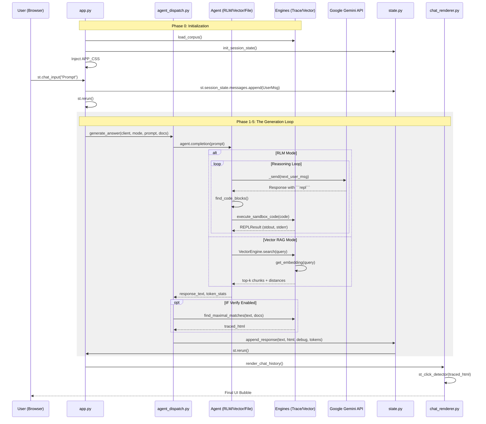

# Exhaustive Code Flow & Function Reference

This document provides a comprehensive map of every function call and data transformation in the portfolio application, from boot-up to interactive verification.

---

## 1. High-Level Sequence Diagram



---

## Phase 0: Initialization & Boot
**File:** [app.py](file:///c:/Users/khuon/portfolio/app.py)

1.  **`load_corpus(data_dir)`** ([trace_engine.py](file:///c:/Users/khuon/portfolio/engines/trace_engine.py)): Walks the `data/` directory, reads `.md`, `.txt`, `.pdf`, and `.docx` files into a persistent dictionary.
2.  **`get_cached_corpus()`**: Wraps the loader in `@st.cache_data` to prevent disk thrashing on every rerun.
3.  **`init_session_state()`** ([state.py](file:///c:/Users/khuon/portfolio/state.py)): Ensures `messages`, `debug_log`, `clicked_states`, and `view_doc` keys exist in Streamlit memory.
4.  **`render_sidebar()`** ([sidebar.py](file:///c:/Users/khuon/portfolio/utils/sidebar.py)): Paints the profile card and social links.
5.  **`APP_CSS` Injection** ([styles.py](file:///c:/Users/khuon/portfolio/styles.py)): Injects custom CSS via `st.markdown(APP_CSS, unsafe_allow_html=True)`.

## Phase 1: User Input
1.  **`st.chat_input()`**: Captures the string.
2.  **`log_event(msg)`** ([state.py](file:///c:/Users/khuon/portfolio/state.py)): Adds a timestamped entry to the console and internal log.
3.  **`messages.append()`**: Stores the user turn.
4.  **`st.rerun()`**: Triggers a fresh execution of the script.

## Phase 2: Orchestration (Agent Dispatch)
**File:** [agent_dispatch.py](file:///c:/Users/khuon/portfolio/components/agent_dispatch.py)

1.  **`generate_answer(...)`**: The main entry point for AI logic.
2.  **`_make_logger(status, steps_log)`**: A closure that redirects agent logs to the `st.status` widget for real-time "thinking" updates.
3.  **Document Sandboxing**: Filters `docs` to exclude `summaries/` for RLM and Vector modes.
4.  **Strategy Selection**: Instantiates `RLMAgent`, `VectorRAGAgent`, or `FileBasedAgent`.

## Phase 3: Reasoning (Agent Layer)

### Recursive Language Model (RLM)
**File:** [rlm_agent.py](file:///c:/Users/khuon/portfolio/agents/rlm/rlm_agent.py)
*   **`completion(user_query)`**: The iterative loop.
*   **`_send(next_user_msg)`**: Manages the `client.chats.create` and `chat.send_message` calls to Gemini.
*   **`find_code_blocks(text)`**: Regex-based extraction of ```repl``` segments.
*   **`execute_code(code)`**: Wrapper around **`execute_sandbox_code`** ([base.py](file:///c:/Users/khuon/portfolio/agents/rlm/base.py)), which uses a restricted `__builtins__` dictionary to run code safely via Python's `exec()`.
*   **`find_final_answer(text)`**: Looks for the `FINAL(...)` trigger to break the loop.
*   **`llm_query_callback(prompt)`**: Exposed to the LLM's Python REPL to allow sub-questions.

### Vector RAG
**File:** [vector_store.py](file:///c:/Users/khuon/portfolio/agents/vector/vector_store.py)
*   **`VectorEngine.search(query)`**: Orchestrates the semantic lookup.
*   **`is_stale(docs)`**: Compares current files against **`_corpus_fingerprint`** to see if a rebuild is needed.
*   **`chunk_text(text)`**: Splits documents using a sliding window with overlap.
*   **`get_embedding(text)`**: Calls Gemini Embedding API with automatic **429 Rate Limit** retry logic (`retryDelay` parsing).
*   **`build_index(docs)`**: Clears ChromaDB and re-populates it with new embeddings.

### File-Based Context
**File:** [file_based_agent.py](file:///c:/Users/khuon/portfolio/agents/file_based/file_based_agent.py)
*   **`completion(...)`**: Implements both "Fast" and "Router" modes.
*   **Router Logic**: Extracts filenames from LLM output using `re.search(r'\[.*\]', ...)` to parse JSON.

## Phase 4: Verification (Trace Engine)
**File:** [trace_engine.py](file:///c:/Users/khuon/portfolio/engines/trace_engine.py)

1.  **`find_maximal_matches(response, corpus)`**: The core verification algorithm.
    *   Iterates through every character of the response.
    *   Uses a greedy search to find the longest verbatim match (min 15 chars) in any document.
    *   Escapes HTML special characters via `html.escape()`.
    *   Wraps matches in clickable `<a>` tags with a `filename:::phrase` payload.

## Phase 5: State Persistence
1.  **`append_response(content, html, ...)`** ([state.py](file:///c:/Users/khuon/portfolio/state.py)): Saves the assistant's turn.
2.  **`st.rerun()`**: Triggers the final rendering pass.

## Phase 6: Rendering & Interaction
**File:** [chat_renderer.py](file:///c:/Users/khuon/portfolio/components/chat_renderer.py)

1.  **`render_chat_history()`**: Iterates over `st.session_state.messages`.
2.  **`st_click_detector()`**: Renders the `traced_html` and captures user clicks on highlighted phrases.
3.  **`render_document_viewer(docs)`**: Displays the source document in a 2nd column if `st.session_state.view_doc` is active.
    *   Calculates a **Context Snippet** (±1000 chars around the match).
    *   Injects a CSS-styled `<span>` to highlight the specific phrase within the document.

---

## Function Directory

| Layer | Function | File | Description |
|---|---|---|---|
| **Entry** | `st.chat_input` | `app.py` | Captures user prompt. |
| **Orch** | `generate_answer` | `agent_dispatch.py` | Strategy router for agents. |
| **Orch** | `_make_logger` | `agent_dispatch.py` | Closure for routing logs to `st.status`. |
| **Reason** | `agent.completion` | `agents/*_agent.py` | Main AI logic entry point. |
| **Logic** | `execute_sandbox_code`| `agents/rlm/base.py` | Securely runs model-generated Python. |
| **Logic** | `build_corpus` | `agents/rlm/base.py` | Bundles documents into a searchable string. |
| **Logic** | `format_execution_result`| `agents/rlm/base.py` | Formats REPL output for the model. |
| **Logic** | `VectorEngine.search` | `agents/vector/vector_store.py`| Semantic search via ChromaDB. |
| **Logic** | `get_embedding` | `agents/vector/vector_store.py`| API call with rate-limit retries. |
| **Logic** | `_corpus_fingerprint` | `agents/vector/vector_store.py`| Stable ID for index invalidation. |
| **Logic** | `chunk_text` | `agents/vector/vector_store.py`| Sliding window document segmentation. |
| **Logic** | `llm_query_batched` | `agents/rlm/rlm_agent.py` | Sequential fan-out for sub-queries. |
| **Service**| `find_maximal_matches`| `engines/trace_engine.py` | Verbatim text tracing algorithm. |
| **Service**| `load_corpus` | `engines/trace_engine.py` | Multi-format local file ingestor. |
| **State** | `append_response` | `state.py` | Persists AI message to history. |
| **State** | `log_event` | `state.py` | Timestamped event logging. |
| **UI** | `st_click_detector` | `components/chat_renderer.py`| Handles verification clicks. |
| **UI** | `render_document_viewer`| `components/chat_renderer.py`| Shows source file + highlight snippet. |
